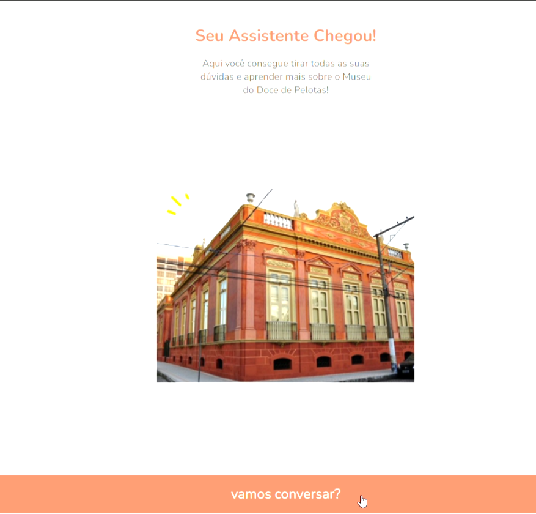
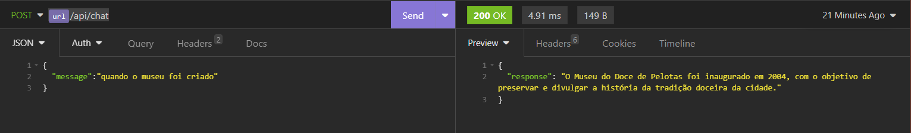
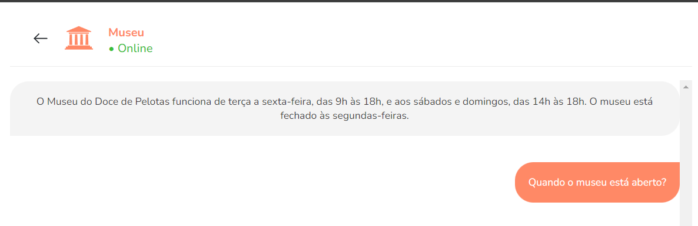

# Chatbot de Museu com Java 21 e Spring Boot 🤖

Este projeto é um chatbot simples para responder perguntas frequentes sobre um museu. O chatbot foi desenvolvido usando Java 21 com Spring Boot e é capaz de fornecer respostas baseadas em palavras-chave definidas em um arquivo JSON.




### 📋 Pré-requisitos

Você precisará ter instalado em sua máquina:
* JDK 21


### 🔧 Instalação

1. Clone o repositório:

```
git clone https://github.com/bfrjunior/projeto-chatbot-museu.git
```


### 📦 Exemplos de Uso

1. Envie uma requisição com uma pergunta para o endpoint:

```
http://localhost:8080/api/chat
```




